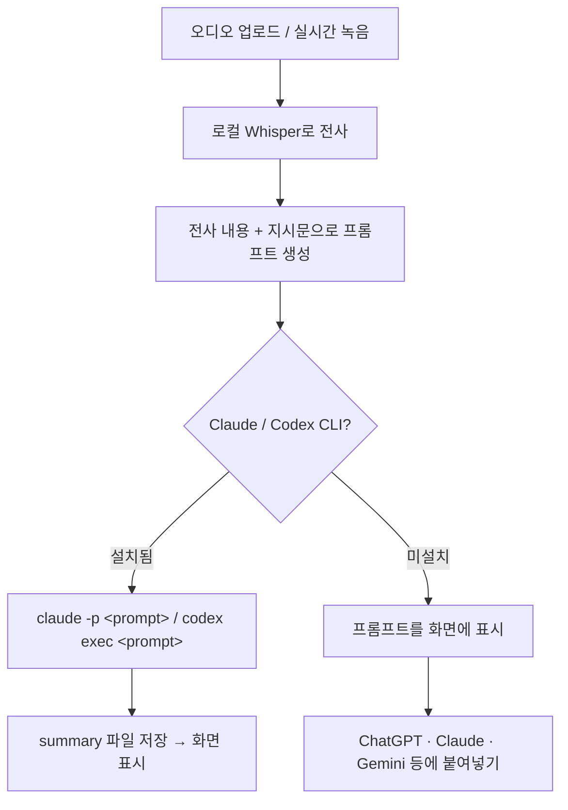

# Locally

로컬 Whisper로 한국어 음성 파일을 전사하고 Claude / Codex CLI로 요약하는 웹 앱


## 기능

- 로컬 웹에서 음성 파일 업로드, 실시간 녹음, Whisper 모델로 전사
- Claude / Codex CLI로 전사된 내용 요약
- CLI 미설치 시 프롬프트 복사 제공 (ChatGPT·Gemini 등 활용 가능)
- macOS Apple Silicon 최적화 (mlx-whisper) / Linux·Windows (faster-whisper)

## 동작 원리



전사 파일을 CLI에 직접 첨부하지 않고, **서버가 파일 내용을 읽어 프롬프트 문자열 안에 포함시켜** CLI에 전달합니다. CLI의 표준 출력(stdout)이 곧 요약 결과가 됩니다.

## 설치

### macOS / Linux

터미널에서 아래 명령을 실행하면 필요한 모든 것을 자동으로 설치하고 브라우저를 엽니다.

```bash
curl -fsSL https://raw.githubusercontent.com/jongmyeong-jeong/locally/main/scripts/install.sh | sh
```

> **Node.js가 없는 경우**: 스크립트는 Homebrew로 Node.js를 설치합니다.
> Homebrew가 없다면 [nodejs.org](https://nodejs.org)에서 인스톨러(`.pkg`)를 먼저 설치한 뒤 스크립트를 실행하세요.

### Windows (PowerShell)

```powershell
irm https://raw.githubusercontent.com/jongmyeong-jeong/locally/main/scripts/install.ps1 | iex
```

### 직접 빌드

```bash
git clone https://github.com/jongmyeong-jeong/locally.git
cd locally
```

의존성 설치 및 첫 실행:

```bash
make setup
# 또는
sh scripts/install.sh
```

## 실행

```bash
locally start
```

직접 빌드한 경우 `make start`도 동일하게 동작합니다.

## 데이터 위치

모든 데이터는 `~/.locally/` 에 저장됩니다.

```
~/.locally/
├── workspace/
│   ├── documents/  # 전사·요약·프롬프트 파일
│   └── audio/      # 업로드된 오디오 파일
├── models/         # Whisper 모델
├── logs/
├── db.sqlite
└── runtime.json
```

## 문제 해결

### 설치 후 `locally` 명령어를 찾지 못하는 경우

터미널을 새로 열거나 아래를 실행하세요:

```bash
source ~/.zshrc   # zsh
source ~/.bashrc  # bash
```

### 설치 중 오류 발생

스크립트가 멱등적으로 설계되어 이미 설치된 단계는 건너뜁니다. 오류 메시지에 표시된 명령을 실행한 뒤 스크립트를 다시 실행하세요.

### Claude / Codex CLI가 설치되어 있지 않은 경우

AI에 입력할 프롬프트를 복사할 수 있습니다. ChatGPT, Claude, Gemini 등 원하는 AI에 붙여넣어 사용할 수 있습니다.
